<!-- Animated Dynamic Banner -->

 

---

<h3> 👋 Hi there! I'm Valdir Luz! 😎 </h3>

Desenvolvedor Full Stack | Java | Spring Boot | React | AWS | Terraform | Docker | Tailwind CSS | APIs REST 

Building high-productivity ecosystems through modular components, clean architectures, and scalable cloud infrastructure.

---

### 🧠 Core Focus
- **Advanced Full Stack Development** utilizing Java within the Spring Boot ecosystem, seamlessly integrated with modern React interfaces.
- **Modular Microservices Architecture** applying Clean Code, Domain-Driven Design (DDD), and SOLID principles to ensure long-lasting systems.
- **Software Engineering & Acceleration** driven by workflow automation, highly reusable component libraries, and agile continuous delivery methodologies.
- **Distributed & Cloud-Native Systems** architected for high availability, fault tolerance, and end-to-end data integrity.

---

### ⭐ Current Goals
- Expanding expertise in **large-scale container orchestration** using Kubernetes natively and agnostically across multiple clouds.
- Evolving backend strategies for monitoring, real-time data telemetry, and distributed infrastructure efficiency.
- Refining advanced **System Design** patterns, focusing on operational cost optimization and integrated repository security.

---

## ☕ Robust Back-End & Architecture

## 🌐 Modular Front-End & Interfaces

## 📱 Mobile Development

## ☁️ Infrastructure, Cloud & DevOps

## 🛠️ Tools & Ecosystem

---

## 📈 GitHub Stats

&nbsp;&nbsp;

---

*"Any fool can write code that a computer can understand. Good programmers write code that humans can understand."* — Martin Fowler

